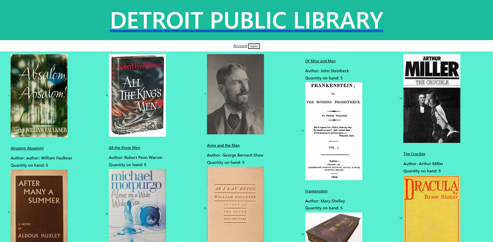

# Group Project 2
# Library Full Stack Project


## Description
This is the second group project that was assigned through MSU Coding Bootcamp. 

We had to create a fullstack application, and we decided to to make a library app. In the app we wanted a user to be able to look through our database of books so that they could checkout them out and then return them.


## Project Requirements
```
-Use Node.js and Express.js to create a RESTful API.
-Use Handlebars.js as the templating engine.
-Use MySQL and the Sequelize ORM for the database.
-Have both GET and POST routes for retrieving and adding new data.
-Be deployed using Heroku (with data).
-Use at least one new library, package, or technology that we haven’t discussed.
-Have a polished UI.
-Be responsive.
-Be interactive (i.e., accept and respond to user input).
-Have a folder structure that meets the MVC paradigm.
-Include authentication (express-session and cookies).
-Protect API keys and sensitive information with environment variables.
-Have a clean repository that meets quality coding standards (file structure, naming conventions, best practices for class/id naming conventions, indentation, quality comments, etc.).
-Have a quality README (with unique name, description, technologies used, screenshot, and link to deployed application).
```


## Links
Live Application: https://det-lib.herokuapp.com/

GitHub Repository: https://github.com/bobpruz/project2


## Screenshot 


## Created By
[Robert Prusinowski](https://github.com/bobpruz)  
[Matt Jerich](https://github.com/MJerich)  
[Devonna Whitfield](https://github.com/delite2no)   
[Mario Butler](https://github.com/mbutlertechtraining)  
